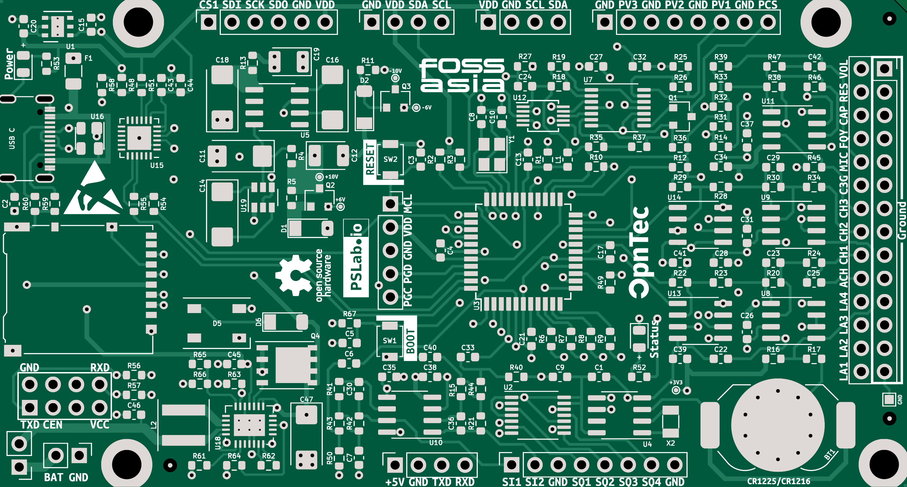
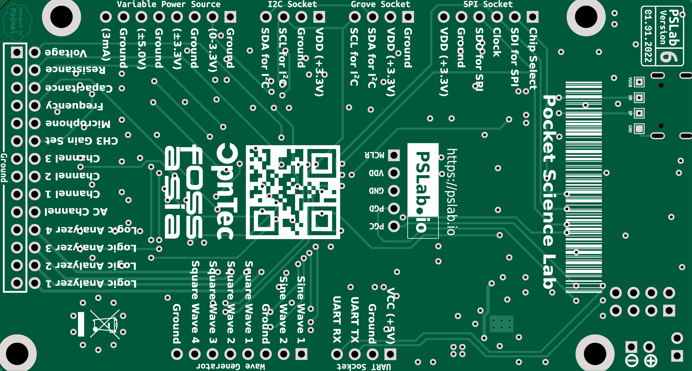
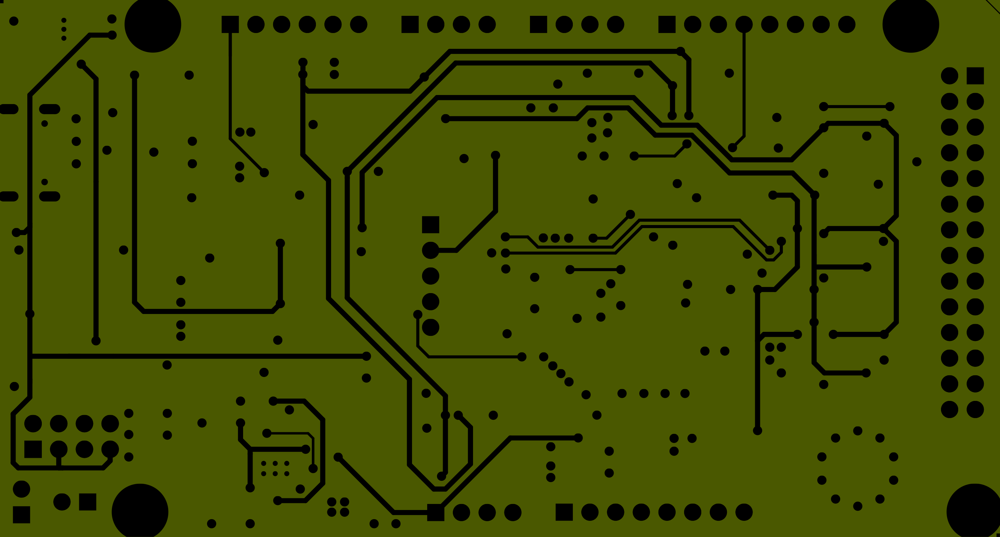
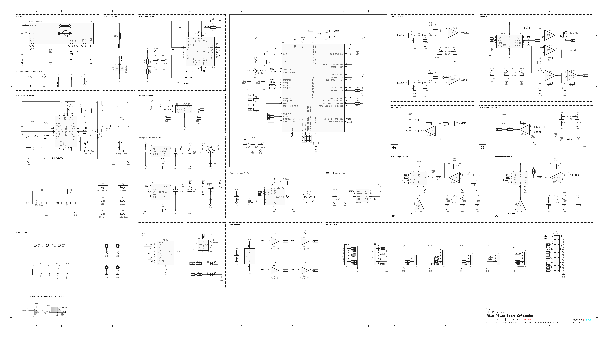
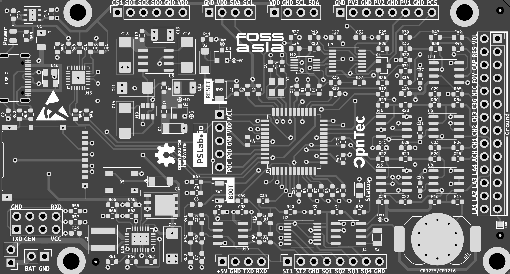
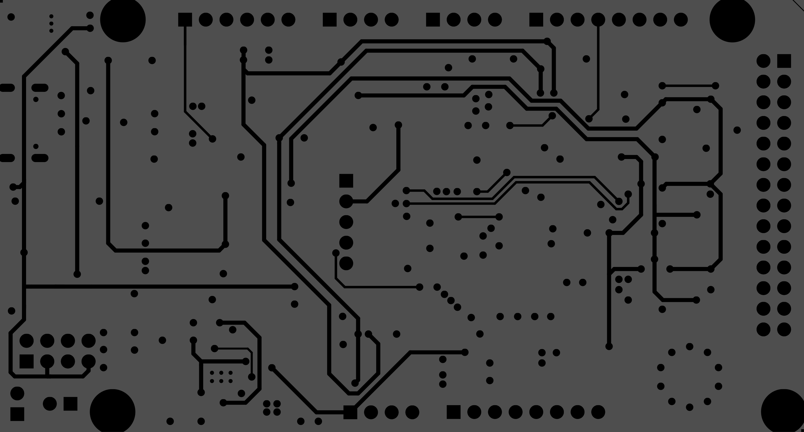

# PSLab Hardware

This is a special branch `diff-img` where the changes made on all four layers relative to the immediate previous board is presented as a diff image.

## Current Layers

  
External Layers

| Top | Bottom |
| --- | ------ |
|  |  |

  
Internal Layers

| Power | Signal |
| ----- | ------ |
|  |  |

## Legend

🟥 what the new board has

🟦 what the previous board had

## Schematic Changes

## Board Changes
| Top Layer |
| ---------- |
|  |

| Bottom Layer |
| --------- |
|  |

| Power Layer |
| ---------- |
|  |

| Signal Layer |
| --------- |
|  |
