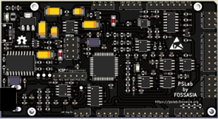

# pslab-hardware

[](https://github.com/fossasia/pslab-hardware/actions/workflows/hardware-ci.yml)
[](https://gitter.im/fossasia/pslab?utm_source=badge&utm_medium=badge&utm_campaign=pr-badge)
[](https://twitter.com/pslabio)

This repository contains the [PSLab](https://pslab.io) hardware design files. PSLab is a tiny pocket science lab that provides an array of test and measurement instruments for doing science and engineering experiments. It can function like an oscilloscope, waveform generator, frequency counter, programmable voltage and current source and also as a data logger. The first version of hardware (v1) was developed by [Jithin B P](https://github.com/jithinbp). Later versions were developed by [Padmal](https://github.com/CloudyPadmal).

## PCB Layout
Front Side                        | Back Side
 -------------------------------- | ----------------------------------
 | 


## Pin-outs
- Find the pin-out diagram of PSLab v6 [here](docs/pin_layouts/PSLab_Pin_Layout.pdf)!

## Applications and Firmware Source Repositories

| [](https://github.com/fossasia/pslab-firmware)	|[](https://f-droid.org/en/packages/io.pslab/)	| [](https://play.google.com/store/apps/details?id=io.pslab)	| [](https://github.com/fossasia/pslab-desktop/tree/install)	| [](https://github.com/fossasia/pslab-desktop/tree/install)	|
|---	|---	|---	|---	|---	|

The following software components are available:
* Firmware: https://github.com/fossasia/pslab-firmware
* Android app: https://github.com/fossasia/pslab-android
* Desktop app: https://github.com/fossasia/pslab-desktop

## Buy Device

* You can get a Pocket Science Lab device from the [FOSSASIA Shop](https://fossasia.com).
* More resellers are listed on the [PSLab website](https://pslab.io/shop/).

## Communication

* Our chat channel is on Gitter here at [PSLab](https://gitter.im/fossasia/pslab)
* Mailing List https://groups.google.com/forum/#!forum/pslab-fossasia

## Repository Structure

```
📦pslab-hardware
 ┣ 📂archives                                   # Source files for previous PSLab versions
 ┃ ┣ 📂Breakout_Boards
 ┃ ┣ 📂PSLab KiCAD
 ┃ ┣ 📂PSLab KiCAD v2
 ┃ ┗ 📂PSLab KiCAD v3
 ┣ 📂docs                                       # Supplementary material
 ┃ ┣ 📂components
 ┃ ┃ ┣ 📜BillOfMaterials.csv                    # Component list
 ┃ ┃ ┗ 📜InteractiveBoM.html                    # Interactive version of BoM
 ┃ ┣ 📂datasheets                               # PDF datasheets for components used in PSLab
 ┃ ┣ 📂drawings                                 # CAD dimension drawings
 ┃ ┣ 📂images
 ┃ ┃ ┣ 📂pslab_version_previews
 ┃ ┃ ┣ 📜 ...
 ┃ ┃ ┗ 📜PSLab_v6_top.png
 ┃ ┣ 📂pin_layouts                              # Pin labels and specifications
 ┃ ┃ ┣ 📜PSLab_Pin_Layout.pdf
 ┃ ┃ ┗ 📜PSLab_Pin_Layout.svg
 ┃ ┣ 📂position_files
 ┃ ┃ ┗ 📜PositionFile.csv                       # Pick and place information
 ┃ ┣ 📂reference                                # TeX documentation (stale)
 ┃ ┗ 📂schematics
 ┃ ┃ ┗ 📜PSLab.pdf                              # Board schematic in PDF
 ┣ 📂output
 ┃ ┣ 📂Gerber                                   # Gerber files for the current board design
 ┃ ┗ 📂Images                                   # Images of the four copper layers
 ┣ 📂print                                      # Silk screen images
 ┃ ┣ 📂Back-Side-Images
 ┃ ┗ 📜Readme.md
 ┗ 📂schematics                                 # KiCAD project files
   ┣ 📂3DModels                                 # STEP 3D models
   ┣ 📂PSLab.pretty                             # Custom library files
   ┣ 📜 ...
   ┗ 📜PSLab.pro                                # Main project file
```

## Version Information

| Version | Content | Preview |
| -------------- | ------- | ------- |
| PSLab KiCAD v1   | Original version with `SEELABLET` schematics and layout files |  |
| PSLab KiCAD v2 | Developed version with new additions (Voltage regulator, Oscillator) |  |
| PSLab KiCAD v3 | Device layout changed to Arduino Uno form factor |  |
| PSLab KiCAD v4 | Assembly optimized version with Arduino Mega form factor having components mounted only on top side |  |
| PSLab KiCAD v5 | Added socket for external bluetooth module and bottom silk screen with pin description |  |
| PSLab KiCAD v6 | Added external power input, RTC module, SD Card slot, USB type C, ESP 01 and upgraded UART and power ICs |  |

## Platform

* Microcontroller Platform : [PIC24EP256GP204](http://www.microchip.com/wwwproducts/en/PIC24EP256GP204)
* IDE: [MPLABX IDE v3.35](http://www.microchip.com/mplab/mplab-x-ide) (Supported on Linux/Windows/Mac)
* Compiler: [MPLAB® XC16 Compiler](http://www.microchip.com/mplab/compilers)
* Programming Tool: [PICkit™ 3 In-Circuit Debugger](http://www.microchip.com/Developmenttools/ProductDetails.aspx?PartNO=PG164130)

## Parts list

* [PIC24EP256GP204](http://www.microchip.com/wwwproducts/en/PIC24EP256GP204) - Microcontroller
* [MCP6S21](http://www.microchip.com/wwwproducts/en/mcp6s21) - Programmable gain amplifier
* [MCP4728](http://www.microchip.com/wwwproducts/en/mcp4728) - 4 Channel DAC
* [TC7660](http://www.microchip.com/wwwproducts/en/TC7660) - Charge Pump voltage invertor
* [TC1240A](http://www.microchip.com/wwwproducts/en/TC1240A) - Charge Pump voltage doubler
* [TL082](http://www.ti.com/product/TL082) - 2 channel Op-Amp
* [LM324](http://www.ti.com/product/LM324) - 4 channel Op-Amp
* [DS1307Z+](https://datasheets.maximintegrated.com/en/ds/DS1307.pdf) - RTC module
* [LDFM33PUR](https://www.st.com/resource/en/datasheet/ldfm.pdf) - 3.3 V regulator
* [LDL212PU50R](https://www.st.com/resource/en/datasheet/ldl212.pdf) - 5.0 V regulator
* [CP2102N-A02-GQFN24](https://www.silabs.com/documents/public/data-sheets/cp2102n-datasheet.pdf) - USB-UART bridge
* [74HC126](http://www.ti.com/product/SN74HC126) - 4 channel buffer
* [SP0503BAHTG](https://m.littelfuse.com/~/media/electronics/datasheets/tvs_diode_arrays/littelfuse_tvs_diode_array_sp05_datasheet.pdf.pdf) - ESD protector

* 0.5 A Fuse
* Assorted resistors, capacitors & diodes

Find the complete bill of materials from [this link](docs/components/BillOfMaterials.csv).

### Optional Parts

Extension slots for an ESP is available.
* [ESP8266 (ESP-01)](http://www.microchip.ua/wireless/esp01.pdf) - UART-TCP bridge

## Hardware Specs

* 3-Channel up to 2MSPS Oscilloscope. Software selectable amplification stages
* 12-bit Voltmeter with programmable gain. Input ranges from +/-10 mV to +/-16 V
* 3x 12-bit Programmable voltage sources +/-3.3 V,+/-5V,0-3 V
* 12-bit Programmable current source. 0-3.3 mA
* Supports Advanced plugins/Add-on Modules
* 4-Channel, 4 MHz Logic Analyzer
* 2x Sine/Triangular wave generators. 5 Hz to 5 KHz. Manual amplitude control for SI1
* 4x PWM generators. 15 nS resolution. Up to 8 MHz
* Capacitance Measurement. pF to uF range
* I2C, SPI and UART data buses for Accelerometer gyroscope humidity and temperature sensor modules etc

## Feature list for the acquisition and control

### Oscilloscopes

One of the main features of PSLab is the 3-channel Oscilloscope which can monitor analog inputs at maximum of 2 million samples per second. It includes controls such as triggering, and gain selection. Uses Python-Scipy for curve fitting.

### Waveform Generators

* SI1 : 5 Hz – 5 KHz arbitrary waveform generator. Manual amplitude control up to +/-3 Volts
* SI2 : 5 Hz – 5 KHz arbitrary waveform generator. Amplitude of +/-3 Volts. Attenuable via software
* SQx : There are four phase correlated PWM outputs with maximum frequency 32 MHz, 15 nano second duty cycle, and phase difference control.

### Measurement Functions

* Frequency counter tested up to 16 MHz.
* Capacitance Measurement. pF to uF range
* PSLab has several 12-bit analog inputs (function as voltmeters) with programmable gains, and maximum ranges varying from +/-5 mV to +/-16 V.

### Voltage and Current Sources

* 12-bit Constant Current source. Maximum current 3.3 mA (subject to load resistance).
* PSLab has three 12-bit Programmable voltage sources +/-3.3 V,+/-5 V,0-3 V. (PV1, PV2, PV3) controls

### Other useful tools

* 4MHz, 4-channel Logic analyzer with 15 nS resolution. Voltage and current sources
* SPI, I2C and UART outputs
* Graphical Interfaces for Oscilloscope, Logic Analyser, streaming data and several experiments developed that use a common framework which drastically reduces code required to incorporate control and plotting widgets.
* PSLab also has space for an ESP-01 module for WiFi access with access point/station mode.
