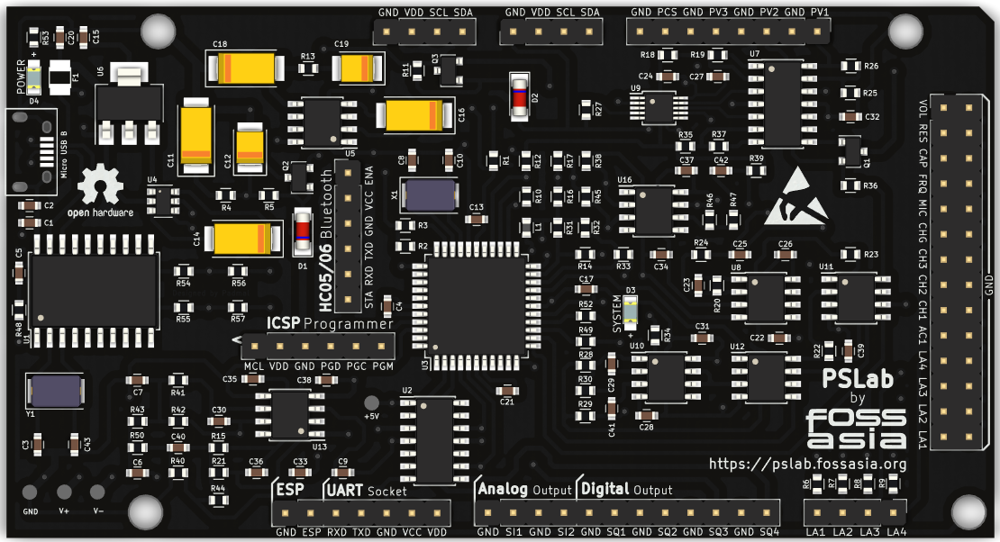

# PSLab Hardware

Hardware development and schematics repository for the [Pocket Science Lab (PSLab)](https://pslab.io) open-hardware platform.

The goal of Pocket Science Lab is to create an Open Source hardware device (open on all layers) and software applications that can be used for experiments by teachers, students and scientists. Our tiny pocket lab provides an array of instruments for doing science and engineering experiments. It provides functions of numerous measurement tools including an oscilloscope, a waveform generator, a frequency counter, a programmable voltage, current source and even a component to control robots with up to four servos. Our website is at https://pslab.io. The first version of the hardware (v1) was developed by [Jithin B P](https://pslab.io/team/). Later versions were developed by [Padmal](https://github.com/CloudyPadmal).

Front Side                        | Back Side
 -------------------------------- | ----------------------------------
 | 

Please find the pin-out diagram of the PSLab v5 [here](docs/pin_layouts/PSLab_Pin_Layout.pdf).

## Applications and Firmware Source Repositories

| 	|	| 	| 	| 	|
|---	|---	|---	|---	|---	|

The following software components are available:
* Firmware: https://github.com/fossasia/pslab-firmware
* Android app: https://github.com/fossasia/pslab-android
* Desktop app: https://github.com/fossasia/pslab-desktop

## Buy Device

* You can get a Pocket Science Lab device from the [FOSSASIA Shop](https://fossasia.com).
* More resellers are listed on the [PSLab website](https://pslab.io/shop/).

## Communication

* The PSLab [chat channel is on Gitter](https://gitter.im/fossasia/pslab).
* Please also join us on the [PSLab Mailing List](https://groups.google.com/forum/#!forum/pslab-fossasia).

## Content of Repository

* **/archives**: Contains previous versions of PSLab schematics
* **/docs**: Supplement materials, schematics as PDFs, images of PSLab
* **/schematics**: PCB layout of PSLab device

## Hardware Specifications

* 4-Channel up to 2MSPS Oscilloscope with software selectable amplification stages.
* 12-bit Voltmeter with programmable gain. Input ranges from +/-10 mV to +/-16 V
* 3x 12-bit Programmable voltage sources +/-3.3 V,+/-5V,0-3 V
* 12-bit Programmable current source. 0-3.3 mA
* Supports Advanced Plugins/Add-on Modules
* 4-Channel, 4 MHz, Logic Analyzer
* 2x Sine/Triangular wave generators. 5 Hz to 5 kHz. Manual amplitude control for SI1
* 4x PWM generators. 15 nS resolution. Up to 8 MHz
* Capacitance Measurement. pF to uF range
* I2C, SPI, UART data buses for Accelerometer, Gyroscope, humidity, temperature modules etc.

## Development Platform

* Microcontroller Platform: [PIC24EP256GP204](http://www.microchip.com/wwwproducts/en/PIC24EP256GP204)
* IDE: [MPLABX IDE v3.35](http://www.microchip.com/mplab/mplab-x-ide) (Supported on Linux/Windows/Mac)
* Compiler: [MPLAB® XC16 Compiler](http://www.microchip.com/mplab/compilers)
* Programming Tool: [PICkit™ 3 In-Circuit Debugger](http://www.microchip.com/Developmenttools/ProductDetails.aspx?PartNO=PG164130)

## Features

### Oscilloscope

One of the main features of PSLab is the 4-channel Oscilloscope which can monitor analog inputs at a maximum of 2 million samples per second. It includes controls such as triggering and gain selection. Uses Python-Scipy for curve fitting.

### Waveform Generator

* SI1: 5 Hz – 5 kHz arbitrary waveform generator. Manual amplitude control up to +/-3 Volts
* SI2: 5 Hz – 5 kHz arbitrary waveform generator. The amplitude of +/-3 Volts. Attenuable via software
* SQx: There are four phases correlated PWM outputs with maximum frequency 32 MHz, 15 nanosecond duty cycle, and phase difference control.

### Measurement Functions

* Frequency counter tested up to 16 MHz.
* Capacitance Measurement. pF to uF range
* PSLab has several 12-bit analog inputs (function as voltmeters) with programmable gains, and maximum ranges varying from +/-5 mV to +/-16 V.

### Voltage and Current Source

* 12-bit Constant Current source. Maximum current 3.3 mA (subject to load resistance).
* PSLab has three 12-bit Programmable voltage sources +/-3.3 V,+/-5 V,0-3 V. (PV1, PV2, PV3) controls

### Other Useful Tools

* 4MHz, 4-channel Logic analyzer with 15 nS resolution.Voltage and Current Sources
* SPI, I2C, UART outputs
* Graphical Interfaces for Oscilloscope, Logic Analyser, streaming data, wireless acquisition and several experiments developed that use a common framework which drastically reduces code required to incorporate control and plotting widgets.
* PSLab also has space for an ESP-12 module for WiFi access with access point/ station mode.

### Advanced Controls
* Advanced Controls with Oscilloscope
* Data Logger
* Logic Analyzer
* Wireless Sensors (Work in progress…)

## Parts List

* [PIC24EP256GP204](http://www.microchip.com/wwwproducts/en/PIC24EP256GP204) - Main uC
* [MCP6S21](http://www.microchip.com/wwwproducts/en/mcp6s21) - Programmable Gain Amplifier
* [MCP4728](http://www.microchip.com/wwwproducts/en/mcp4728) - 4 channel DAC
* [TC7660](http://www.microchip.com/wwwproducts/en/TC7660) - Charge Pump voltage invertor
* [TC1240A](http://www.microchip.com/wwwproducts/en/TC1240A) - Charge Pump voltage doubler
* [TL082](http://www.ti.com/product/TL082) - 2 channel Op-Amp
* [LM324](http://www.ti.com/product/LM324) - 4 channel Op-Amp
* [LM1117](http://www.ti.com/product/LM1117) - 3.3 V regulator
* [MCP2200](http://www.microchip.com/wwwproducts/en/MCP2200) - USB-UART Bridge
* [74HC126](http://www.ti.com/product/SN74HC126) - 4 channel Buffer
* 0.5 A Fuse
* Assorted resistors, capacitors & diodes
* Optional Parts: Extension slots to solder ESP and Bluetooth components to the device are available.
  * [ESP8266 (ESP-12E)](https://www.adafruit.com/product/2491) - UART-TCP bridge
  * Bluetooth

## Version Information

| Version | Content | Image |
| -------------- | ------- | ------- |
| PSLab KiCAD v1   | Original version with `SEELABLET` schematics and layout files |  |
| PSLab KiCAD v2 | Developed version with new additions (Voltage regulator, Oscillator) |  |
| PSLab KiCAD v3 | Device layout changed to Arduino Uno form factor |  |
| PSLab KiCAD v4 | Assembly optimized version with Arduino Mega form factor having components mounted only on top side |  |
| PSLab KiCAD v5 | Added socket for external bluetooth module and bottom silk screen with pin description |  |

## Block Diagram

The following block diagram shows the flow and functions of the hardware and firmware.

## Casing

A lasercut casing design for the Pocket Science Lab is available at https://github.com/fossasia/pslab-case.

## License

This project is Free and Open Source software. The project is licensed under the [Apache License v2](LICENSE). Copyright is owned by FOSSASIA and its contributors. Please refer to the license files for more details.

